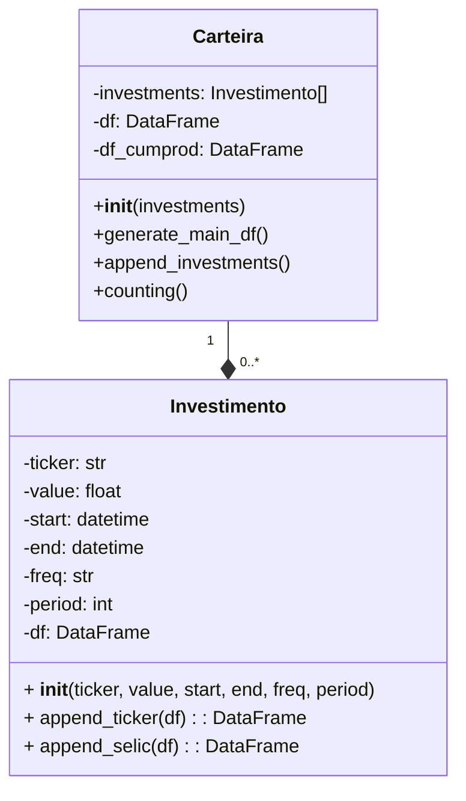
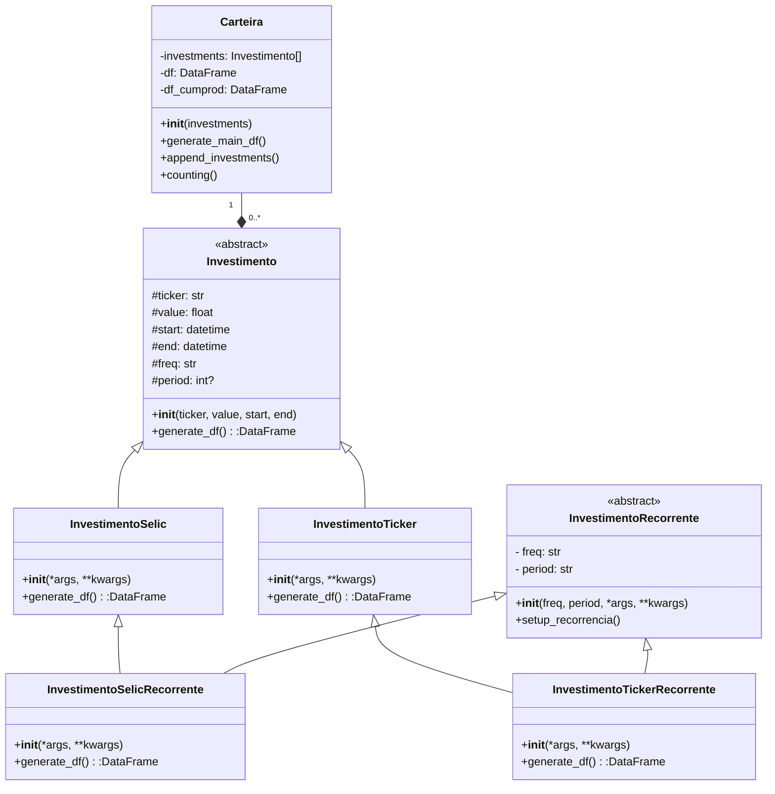
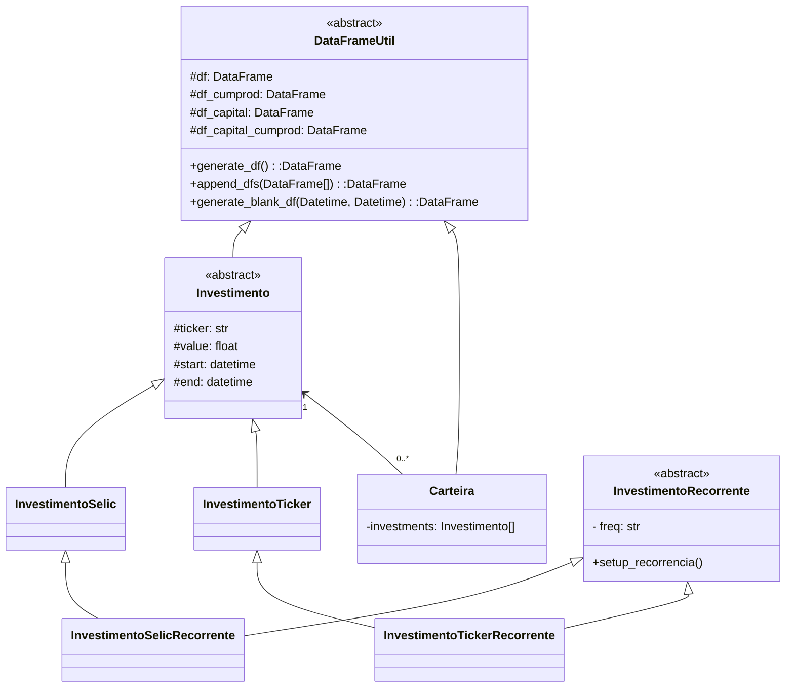
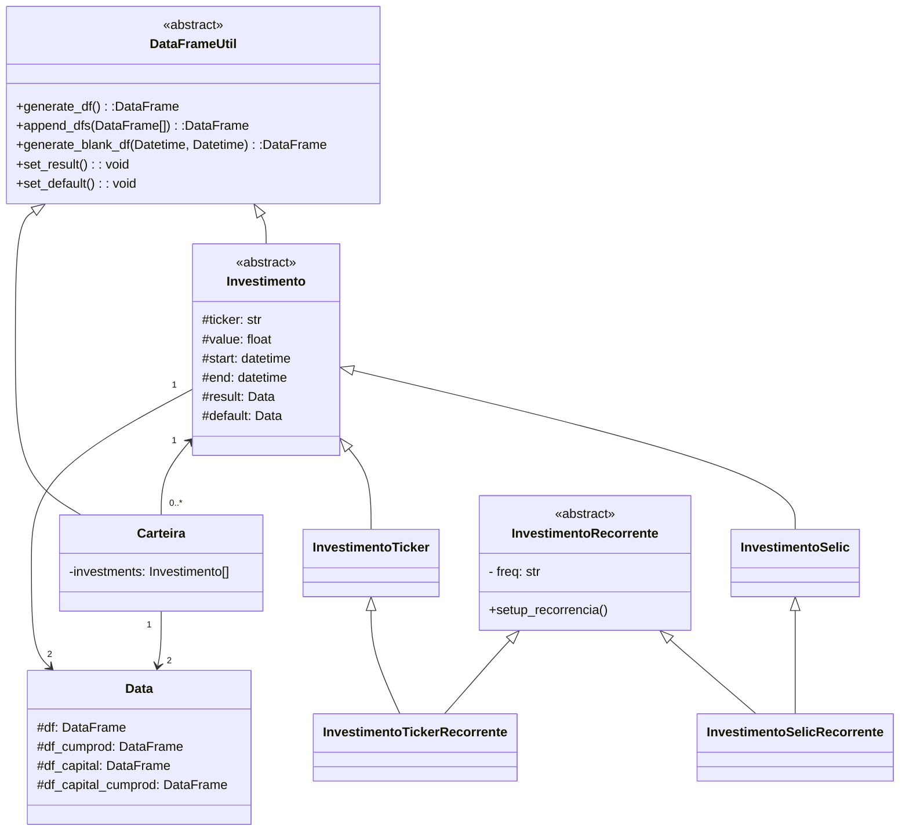
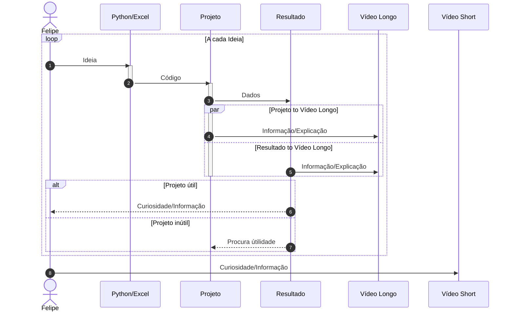

## UML
### UML Inicial

```mermaid
classDiagram

  class Investimento{
    -ticker: str
    -value: float
    -start: datetime
    -end: datetime
    -freq: str
    -period: int
    -df: DataFrame
    + __init__(ticker, value, start, end, freq, period)
    + append_ticker(df): DataFrame
    + append_selic(df): DataFrame
  }

  class Carteira{
    -investments: Investimento[]
    -df: DataFrame
    -df_cumprod: DataFrame
    +__init__(investments)
    +generate_main_df()
    +append_investments()
    +counting()
  }

    Carteira "1" --* "0..*" Investimento

```

### UML v1.2

```mermaid
classDiagram

  class Carteira{
    -investments: Investimento[]
    -df: DataFrame
    -df_cumprod: DataFrame
    +__init__(investments)
    +generate_main_df()
    +append_investments()
    +counting()
  }

    class Investimento{
        <<abstract>>
        #ticker: str
        #value: float
        #start: datetime
        #end: datetime
        #freq: str
        #period: int?
        +__init__(ticker, value, start, end)
        +generate_df():DataFrame
    }
    class InvestimentoSelic{
        +__init__(*args, **kwargs)
        +generate_df():DataFrame

    }
    class InvestimentoTicker{
        +__init__(*args, **kwargs)
        +generate_df():DataFrame
    }
    class InvestimentoRecorrente{
        <<abstract>>
        - freq: str
        - period: str
        +__init__(freq, period, *args, **kwargs)
        +setup_recorrencia()
    }
    class InvestimentoSelicRecorrente{
        +__init__(*args, **kwargs)
        +generate_df():DataFrame
    }
    class InvestimentoTickerRecorrente{
        +__init__(*args, **kwargs)
        +generate_df():DataFrame
    }

    Investimento <|-- InvestimentoSelic
    Investimento <|-- InvestimentoTicker
    InvestimentoSelic <|-- InvestimentoSelicRecorrente
    InvestimentoTicker <|-- InvestimentoTickerRecorrente
    InvestimentoRecorrente <|-- InvestimentoSelicRecorrente
    InvestimentoRecorrente <|-- InvestimentoTickerRecorrente
    Carteira "1" --* "0..*" Investimento
```

### UML v1.3

```mermaid
classDiagram

  class Carteira{
    -investments: Investimento[]
  }

  class Investimento{
      <<abstract>>
      #ticker: str
      #value: float
      #start: datetime
      #end: datetime
  }

  class InvestimentoSelic{
  }

  class InvestimentoTicker{
  }

  class InvestimentoRecorrente{
      <<abstract>>
      - freq: str
      +setup_recorrencia()
  }
  class InvestimentoSelicRecorrente{

  }
  class InvestimentoTickerRecorrente{
  }

  class DataFrameUtil{
    <<abstract>>
    #df: DataFrame
    #df_cumprod: DataFrame
    #df_capital: DataFrame
    #df_capital_cumprod: DataFrame
    +generate_df():DataFrame
    +append_dfs(DataFrame[]):DataFrame
    +generate_blank_df(Datetime, Datetime):DataFrame
  }

  Investimento <|-- InvestimentoSelic
  Investimento <|-- InvestimentoTicker
  InvestimentoSelic <|-- InvestimentoSelicRecorrente
  InvestimentoTicker <|-- InvestimentoTickerRecorrente
  InvestimentoRecorrente <|-- InvestimentoSelicRecorrente
  InvestimentoRecorrente <|-- InvestimentoTickerRecorrente

  Investimento "1" <-- "0..*" Carteira
  
  DataFrameUtil <|-- Investimento
  DataFrameUtil <|-- Carteira
```

### UML v1.4

```mermaid
classDiagram

  class Data {
    #df: DataFrame
    #df_cumprod: DataFrame
    #df_capital: DataFrame
    #df_capital_cumprod: DataFrame
  }

  class Carteira{
    -investments: Investimento[]
  }

  class Investimento{
      <<abstract>>
      #ticker: str
      #value: float
      #start: datetime
      #end: datetime
      #result: Data
      #default: Data
  }

  class InvestimentoSelic{
  }

  class InvestimentoTicker{
  }

  class InvestimentoRecorrente{
      <<abstract>>
      - freq: str
      +setup_recorrencia()
  }
  class InvestimentoSelicRecorrente{

  }
  class InvestimentoTickerRecorrente{
  }

  class DataFrameUtil{
    <<abstract>>
    +generate_df():DataFrame
    +append_dfs(DataFrame[]):DataFrame
    +generate_blank_df(Datetime, Datetime):DataFrame
    +set_result(): void
    +set_default(): void
  }

  Investimento <|-- InvestimentoSelic
  Investimento <|-- InvestimentoTicker
  InvestimentoSelic <|-- InvestimentoSelicRecorrente
  InvestimentoTicker <|-- InvestimentoTickerRecorrente
  InvestimentoRecorrente <|-- InvestimentoSelicRecorrente
  InvestimentoRecorrente <|-- InvestimentoTickerRecorrente

  Investimento "1" <-- "0..*" Carteira
  
  DataFrameUtil <|-- Investimento
  DataFrameUtil <|-- Carteira

  Carteira "1"-->"2" Data
  Investimento "1"-->"2" Data
```

## Fluxo de Conteúdo

```mermaid
sequenceDiagram
    autonumber
    actor Felipe
    participant B as Python/Excel 
    loop A cada Ideia
    Felipe ->> B: Ideia
    activate B
    B ->> Projeto: Código
    deactivate B
    activate Projeto
    Projeto ->> Resultado: Dados
    par Projeto to Vídeo Longo
    Projeto->>Vídeo Longo: Informação/Explicação
    and Resultado to Vídeo Longo
    Resultado->>Vídeo Longo: Informação/Explicação
    end
    deactivate Projeto
    alt Projeto útil
    Resultado -->> Felipe: Curiosidade/Informação
    else Projeto inútil
    Resultado -->> Projeto: Procura útilidade
    end
    end
    Felipe ->> Vídeo Short: Curiosidade/Informação
```