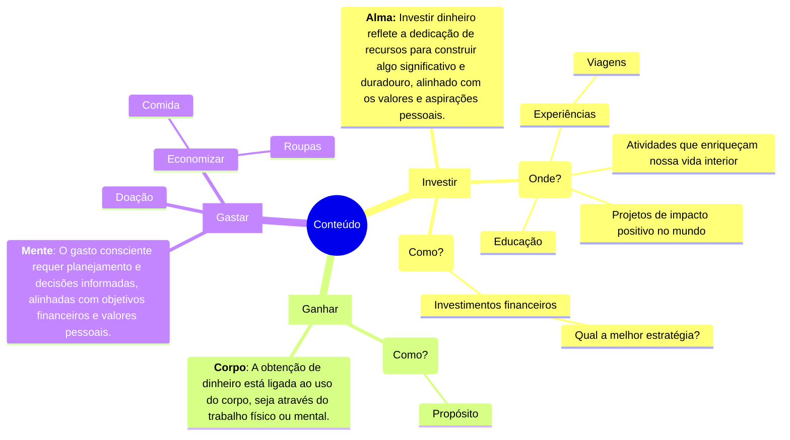
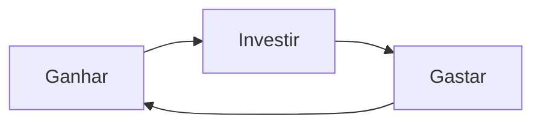

```mermaid
mindmap
  root((Conteúdo <br>))
    [Investir]
        **Alma:** Investir dinheiro reflete a dedicação de recursos para construir algo significativo e duradouro, alinhado com os valores e aspirações pessoais.
        (Onde?)
            Educação
            Experiências
                Viagens
            Atividades que enriqueçam nossa vida interior
            Projetos de impacto positivo no mundo
        (Como?)
            Investimentos financeiros
                Qual a melhor estratégia?
    [Ganhar]
        **Corpo**: A obtenção de dinheiro está ligada ao uso do corpo, seja através do trabalho físico ou mental.
        (Como?)
            Propósito
    [Gastar]
        **Mente**: O gasto consciente requer planejamento e decisões informadas, alinhadas com objetivos financeiros e valores pessoais.
        Doação
        Economizar
            Comida
            Roupas
```

```mermaid 
graph LR
    Ganhar --> Investir --> Gastar
    Gastar --> Ganhar
```